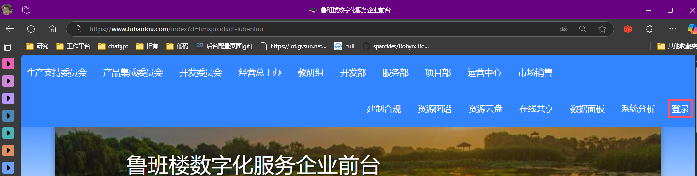
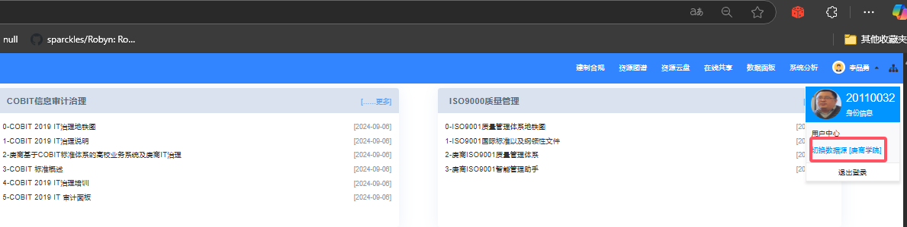
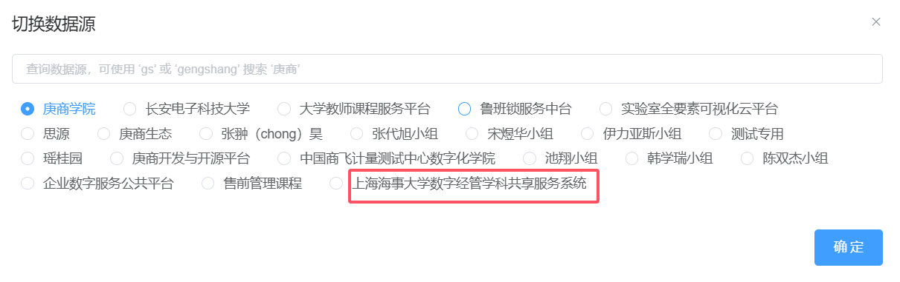
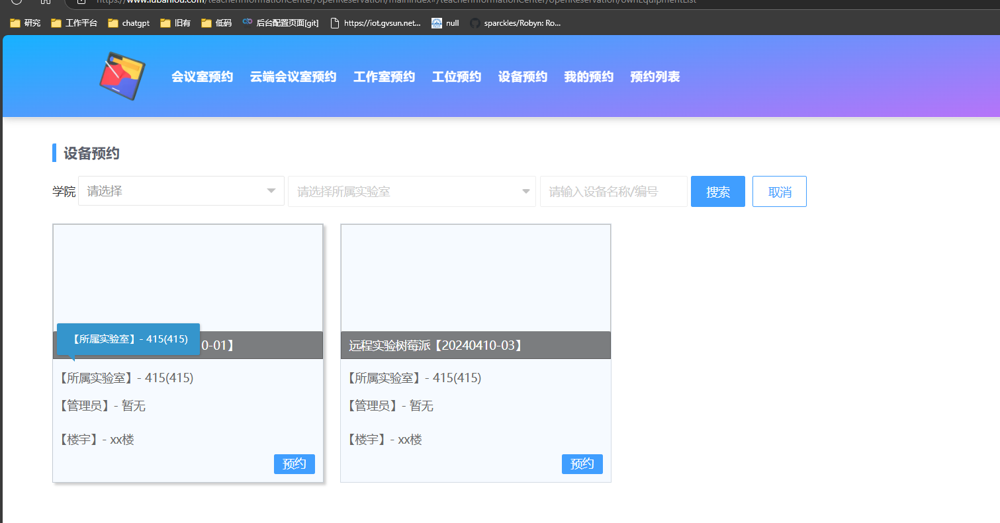
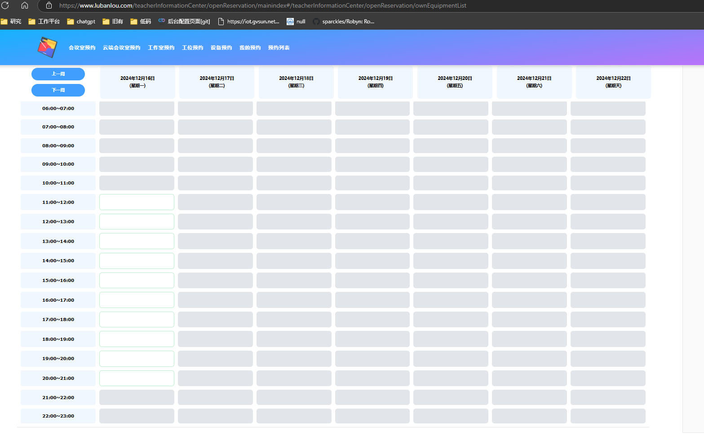
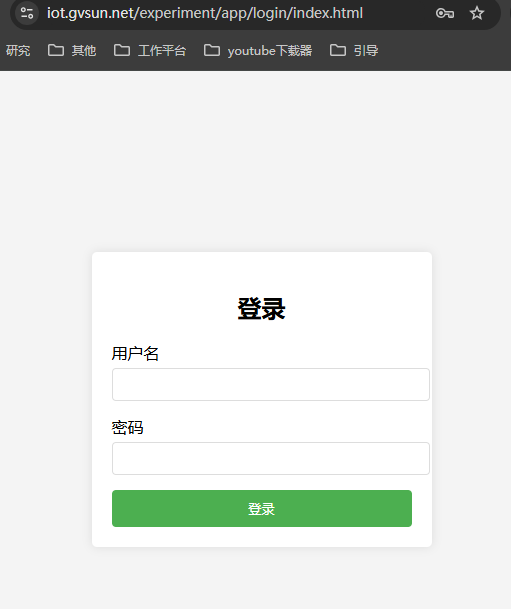
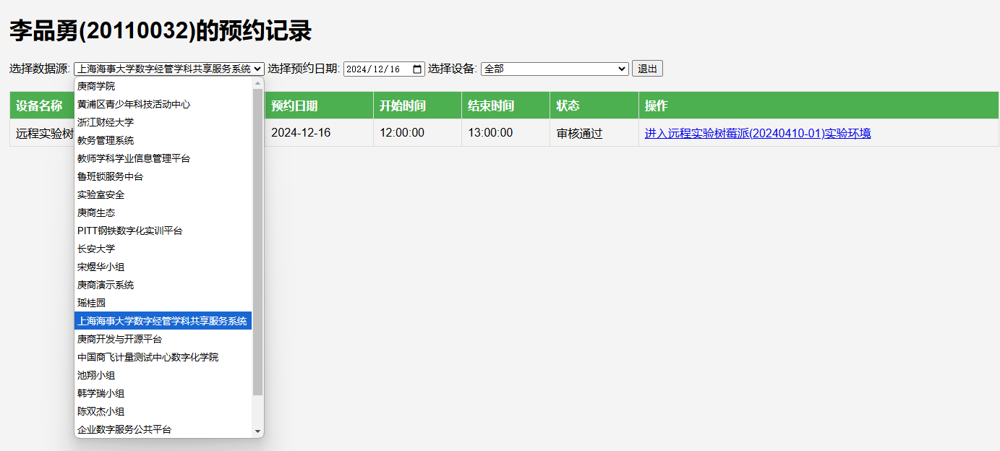
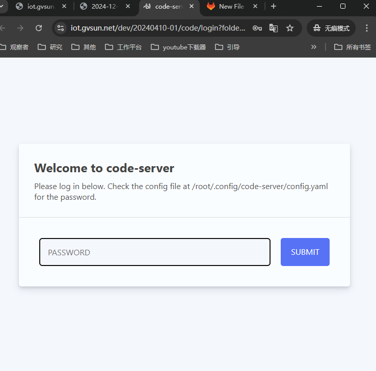

## 访问鲁班楼的开放预约

### 登录云端
- 访问https://www.lubanlou.com/

- 点击右边的登录

- 输入用户名和密码进行登录

- 选择切换数据源

- 切换到海事数据源

### 进入开放预约
- 访问https://www.lubanlou.com/teacherInformationCenter/openReservation/mainindex#/teacherInformationCenter/openReservation/ownEquipmentList

-点击预约按钮，跳转到预约页面，进行预约

## 进行远程实验
开放预约成功后，手机会收到短信。告知使用的时间和访问的地址，但没有收到该信息的话，可访问网页：
https://iot.gvsun.net/experiment/app/login/index.html

使用注册的手机和密码登录，登录成功后，检查一下数据源。请选择正确的数据源

当到达预约时间时可看到操作连接，点击即可进入:
。
默认密码gengshang